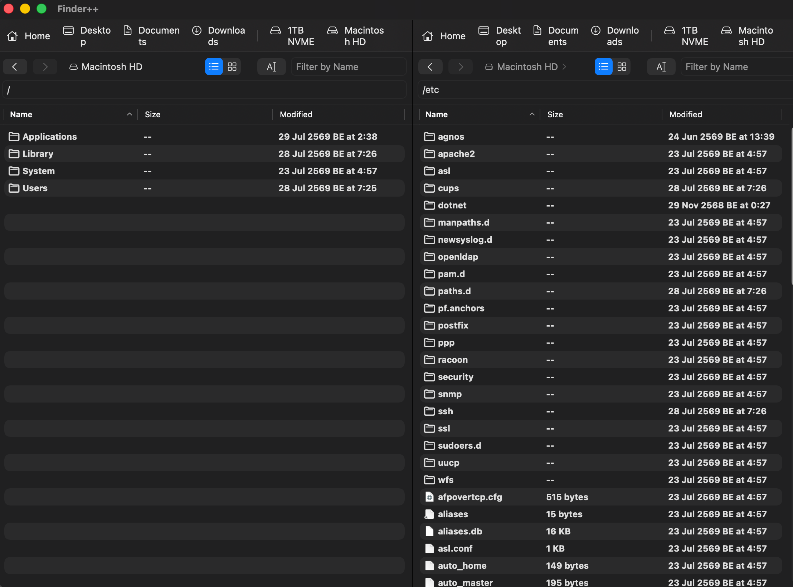

# Finder++

A native macOS file browser built with Swift and SwiftUI — a dual-pane
alternative to Finder.




## Features

- **Dual-pane browsing** with independent navigation, back/forward history,
  and breadcrumb path bars
- **List and icon views**, with real file icons and a per-pane name filter
- **File operations**: copy, move, rename (inline), move to Trash, symbolic
  links, hard links, and file compression (Zip/Tar.gz)
- **Drop targets accept drags from Finder** — same-volume moves,
  cross-volume copies, matching Finder's own convention
- **Copy/paste and paste-and-move** (⌘C / ⌘V / ⌥⌘V) between panes
- **Queued file operations** with a real progress bar, transfer speed, and
  cancellation in a floating, always-on-top window
- **Top favorites bar** for quick access to Home, Desktop, Documents,
  Downloads, and Applications

## Requirements

- macOS 14 (Sonoma) or later
- Swift 6 toolchain (ships with Xcode 16+, or install via Xcode Command Line
  Tools)

Xcode is optional — the project is a plain Swift Package Manager executable,
not an `.xcodeproj`, so it also builds and runs from the command line with
just Command Line Tools installed.

## Building and running

```sh
git clone <this-repo>
cd finder_alternative
swift build   # compile
swift run     # compile and launch the app
swift test    # run the test suite
```

Xcode users can instead open the folder directly (`File > Open` on
`Package.swift`) and run/debug from there.

## Architecture

Standard MVVM, one flat module (`Sources/FinderAlternative`):

- **`Models/`** — `FileItem` (a directory entry, with a stable
  path-derived identity so selection survives directory refreshes),
  `CompressionFormat` (Zip/Tar.gz), `ViewMode` (list/icon).
- **`Services/`** — `FileSystemService` (all filesystem I/O: listing,
  copy/move/rename/link/alias/compress, Finder-style collision naming),
  `FileOperationQueue` (runs file operations in order off the main thread,
  reporting progress), `FileOperationCoordinator` (the app-facing API for
  triggering operations and observing their status).
- **`ViewModels/`** — `FileBrowserViewModel`, one instance per pane: current
  directory, listing, multi-selection, navigation history, name filter.
- **`Views/`** — `ContentView` (the dual-pane shell), `PaneView` (per-pane
  toolbar and content), `FileListView`/`IconGridView` (the two view modes),
  `FileContextMenu` and `FileDragDrop` (menu actions and incoming-drop
  handling shared by both view modes), `CompressSheet`, `BreadcrumbView`,
  `FavoritesBarView`, `OperationProgressWindow`.

## Testing

The test target (`Tests/FinderAlternativeTests`) uses
[Swift Testing](https://developer.apple.com/documentation/testing) and
covers `FileSystemService`'s file operations and collision naming, `FileItem`
identity, and `FileBrowserViewModel` navigation. Run with `swift test`, or
via Xcode's Test Navigator.

## Contributing

Issues and pull requests are welcome.

## Support this project

If you find this app useful, donations are welcome:

[Buy Me a Coffee](https://buymeacoffee.com/lewy.w)

| Currency | Address |
| --- | --- |
| Monero (XMR) | `8AKyo4GbVYE8V7Sy7wb6fqiFpVVHdshPtT9QcMSnwrBE9EqbNfpTyTQcBGxj8tuagYcvJmNZASZU48Q553WiMaEq7KPcUTu` |
| Zcash (ZEC) | `t1g6QAif131irGn4ZNq59SAcpPHAftvjkzP` |
| Ethereum (ETH) | `0x890E83159915c60cCa44D2C6e8c2CA43736e2184` |

## License

[MIT](LICENSE)
